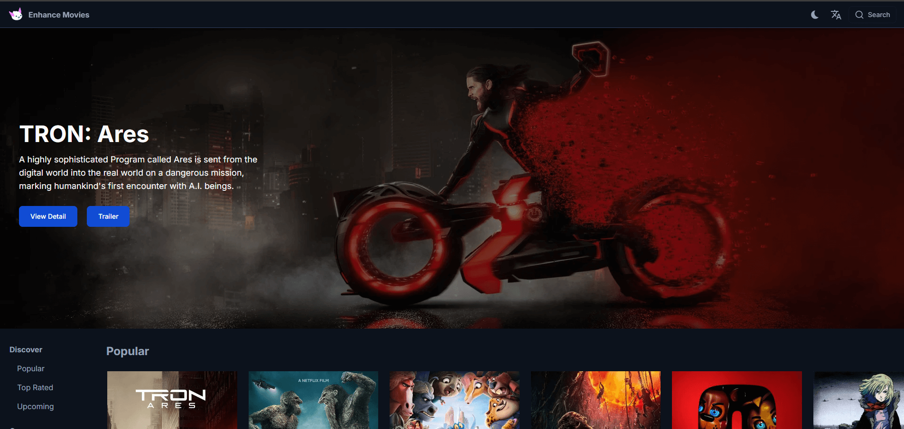

# Nextjs Movies App

> A Movies App build with Next.js 15 and TMDB Api

The design of this project is based on [enhance-movies.com](https://enhance-movies.com).  
You can also explore the source code of the original project here:
[https://github.com/enhance-dev/enhance-movies](https://github.com/enhance-dev/enhance-movies)

## 🌐 Live Demo

👉 [https://next-movie.tuongle.dev](https://next-movie.tuongle.dev)

<p align="center"> </p>

## 🚀 Getting Started

To get started with the Movies web app, follow these steps:

1. Clone the repository:

```bash
git clone https://github.com/tuongle2604/next-movie.git
```

2. Install the dependencies:

```bash
cd next-movie
npm install
```

3. Add NEXT_PUBLIC_IMAGE_BASE_URL to the `.env.local` file:

```bash
NEXT_PUBLIC_IMAGE_BASE_URL=https://image.tmdb.org/t/p
```

4. Obtain an Access Token from [The Movie Database API](https://developers.themoviedb.org/3) and add it to the `.env.local` file:

```bash
TMDB_ACCESS_TOKEN=your-access-token
```

5. Start the development server:

```bash
npm run dev
```

6. Open your browser and navigate to `http://localhost:3000` to view the Movies web app.

## 🛠️ Technologies Used

- [Next.js](https://nextjs.org/) - A React framework for building server-side rendered and static websites.
- [shadcn/ui](https://ui.shadcn.com/) - UI library for fundamental ui elements.
- [Tailwind CSS](https://tailwindcss.com/) - A utility-first CSS framework for rapidly building custom designs.
- [The Movie Database API](https://developers.themoviedb.org/3) - An API that provides access to a vast collection of movie and TV show data.
